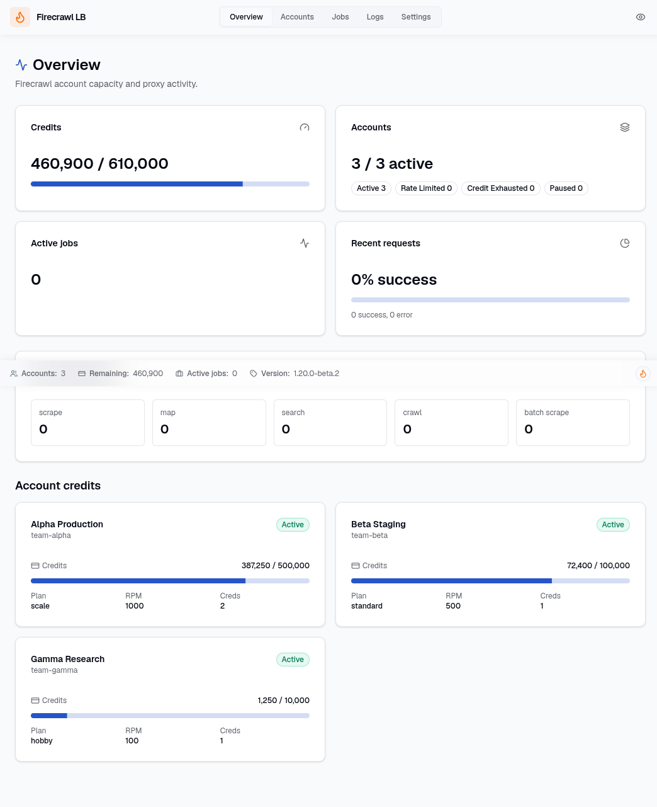
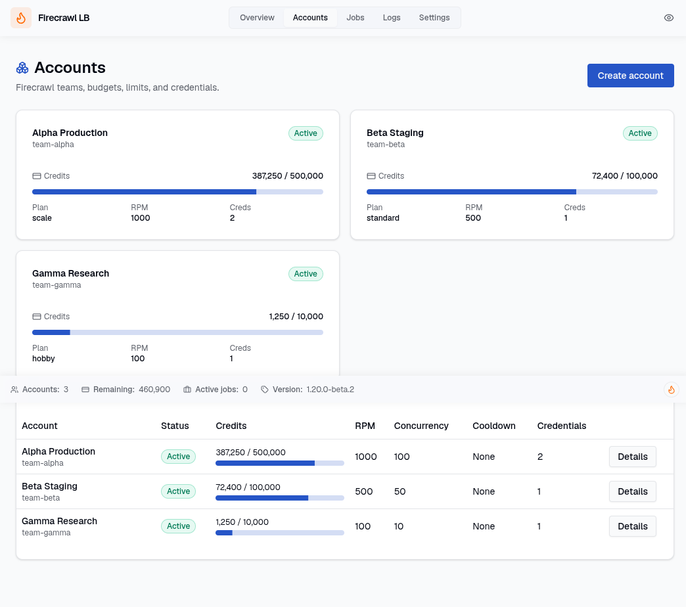
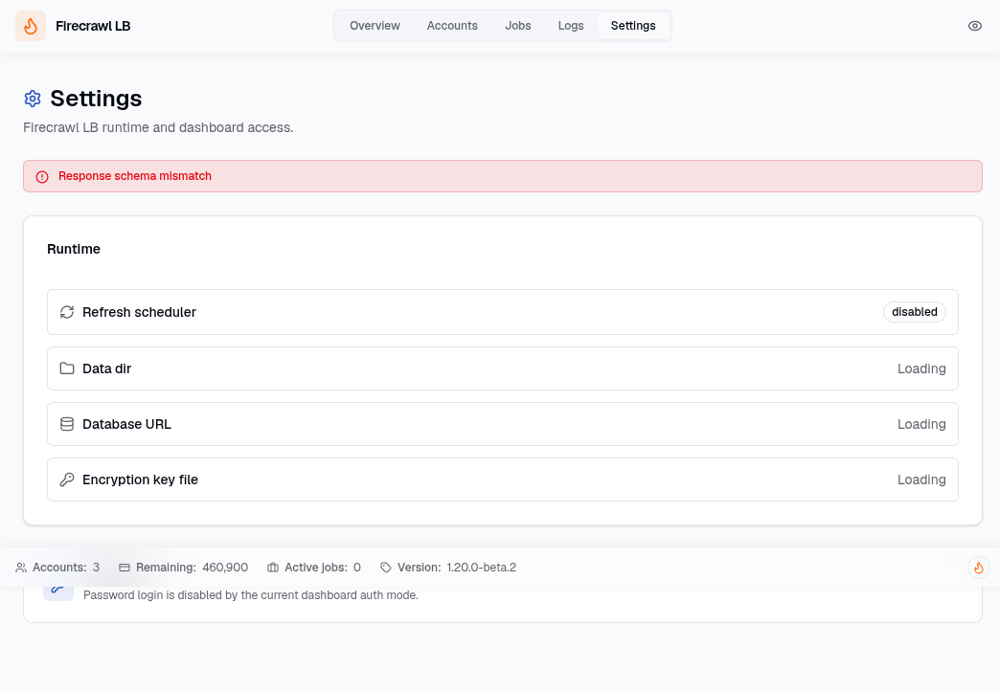
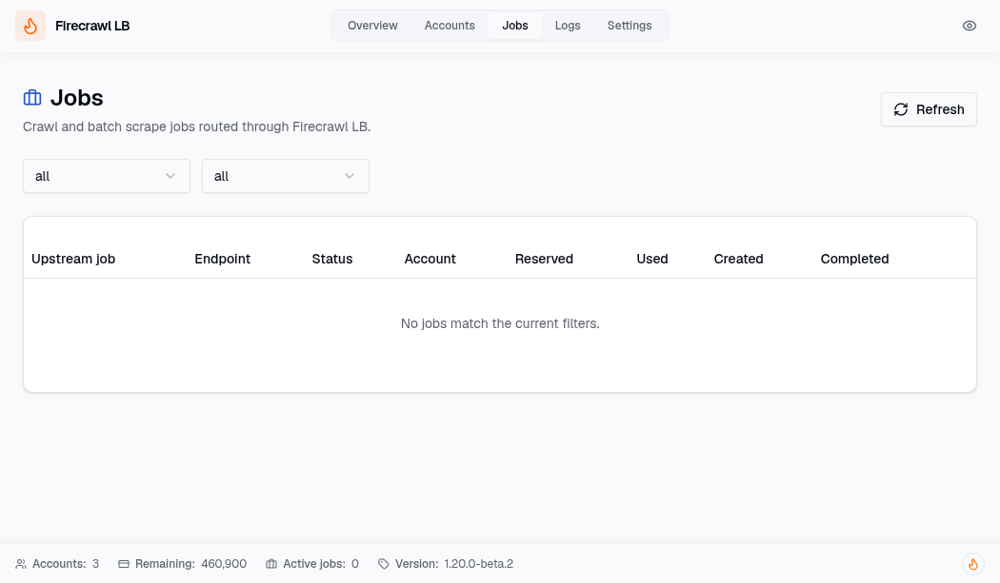
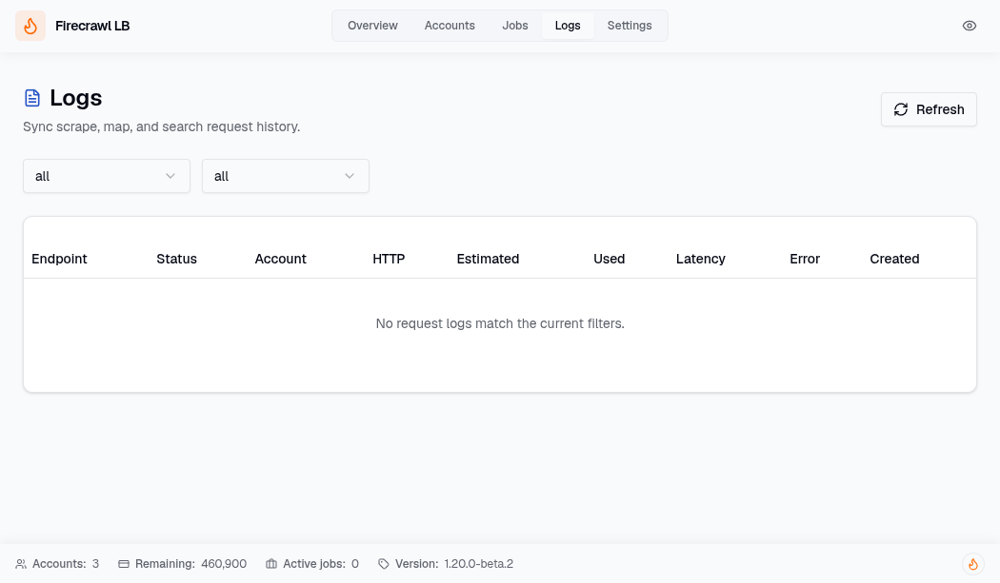
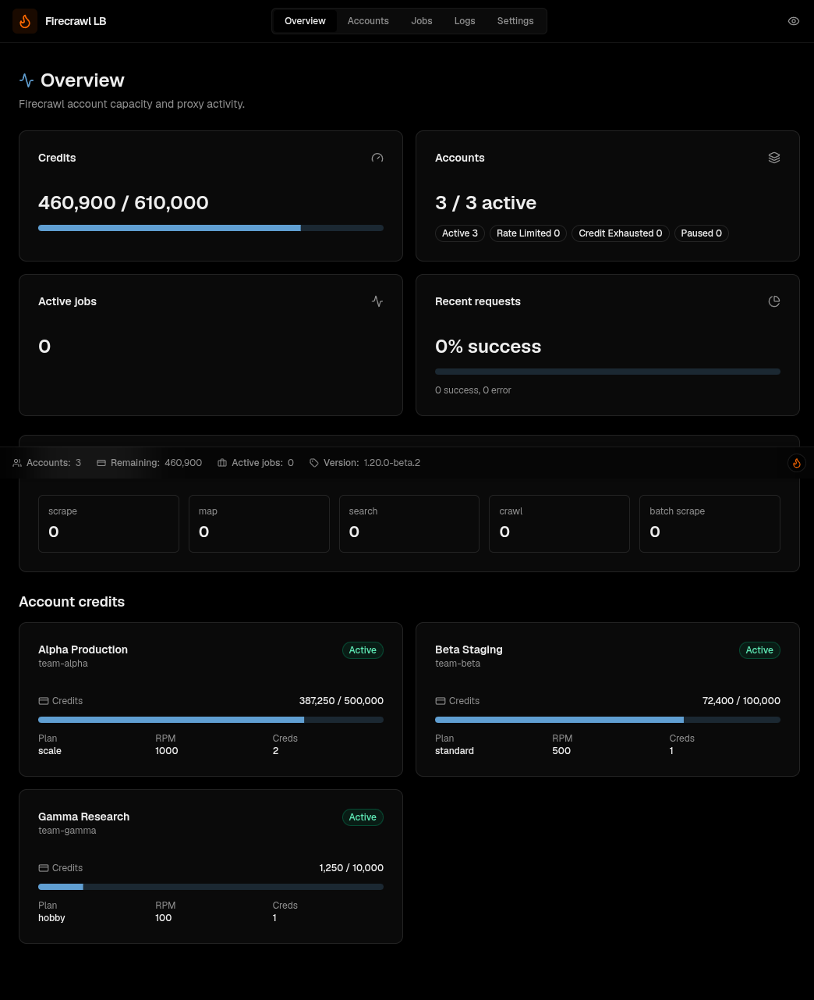
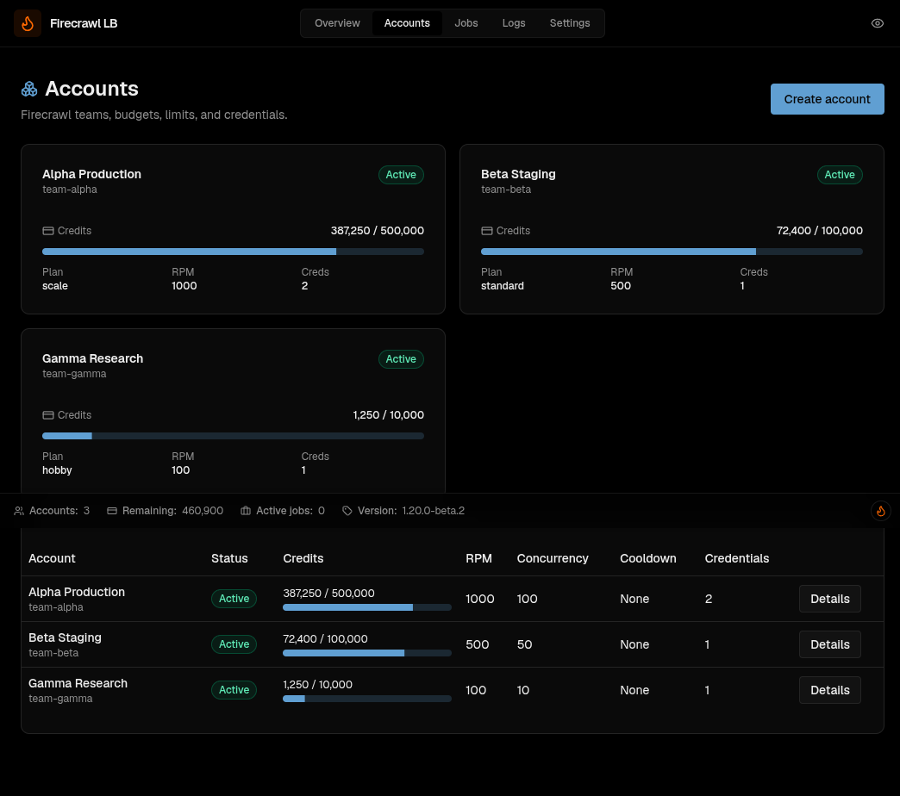
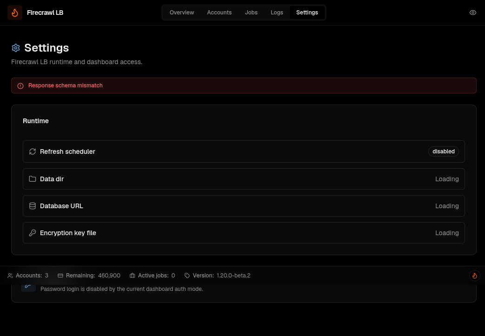

<!--
About
Firecrawl API load balancer & proxy with credit tracking, dashboard, and budget-aware routing
Topics
python sqlalchemy dashboard load-balancer firecrawl rate-limit api-proxy fastapi usage-tracking web-scraping credit-tracking
Resources
-->

# firecrawl-lb

Load balancer for Firecrawl API accounts. Pool multiple teams, track credit usage, manage API keys, view everything in a dashboard.

|  |  |
|:---:|:---:|

<details>
<summary>More screenshots</summary>

| Settings | Jobs | Logs |
|:---:|:---:|:---:|
|  |  |  |

| Overview (dark) | Accounts (dark) | Settings (dark) |
|:---:|:---:|:---:|
|  |  |  |

</details>

## Features

<table>
<tr>
<td><b>Account Pooling</b><br>Load balance across multiple Firecrawl teams</td>
<td><b>Credit Tracking</b><br>Per-account credits, budget, live reconciliation</td>
<td><b>Budget-aware Routing</b><br>Route by remaining credits, RPM, concurrency, health</td>
</tr>
<tr>
<td><b>Dashboard</b><br>Overview, accounts, jobs, logs, settings</td>
<td><b>Firecrawl v2 Proxy</b><br>Scrape, map, search, crawl, batch scrape</td>
<td><b>Job Ownership</b><br>Crawl/batch jobs tracked to originating account</td>
</tr>
</table>

## Quick Start

```bash
# Docker (recommended)
docker volume create firecrawl-lb-data
docker run -d --name firecrawl-lb \
  -p 2465:2465 \
  -v firecrawl-lb-data:/var/lib/firecrawl-lb \
  ghcr.io/soju06/firecrawl-lb:latest

# or local
uv sync
uv run uvicorn app.main:app --host 127.0.0.1 --port 2465
```

Open [localhost:2465](http://localhost:2465) → Add account → Done.

## Remote Setup

When accessing the dashboard remotely for the first time, a bootstrap token is required to set the initial password.

**Auto-generated (default):** On first startup (no password configured), the server generates a one-time token and prints it to logs:

```bash
docker logs firecrawl-lb
# ============================================
#   Dashboard bootstrap token (first-run):
#   <token>
# ============================================
```

Open the dashboard → enter the token + new password → done. The token is shared across replicas and remains valid until a password is set.

**Manual token:** To use a fixed token instead, set the env var before starting:

```bash
docker run -d --name firecrawl-lb \
  -e FIRECRAWL_LB_DASHBOARD_BOOTSTRAP_TOKEN=your-secret-token \
  -p 2465:2465 \
  -v firecrawl-lb-data:/var/lib/firecrawl-lb \
  ghcr.io/soju06/firecrawl-lb:latest
```

**Local access** (localhost) bypasses bootstrap entirely.

## Configure Accounts

Create an account (one per Firecrawl team):

```bash
curl -X POST http://127.0.0.1:2465/v2/admin/firecrawl/accounts \
  -H 'content-type: application/json' \
  -d '{
    "id": "team-a",
    "team_label": "Team A",
    "plan_type": "standard",
    "monthly_budget_credits": 100000,
    "remaining_credits_live": 100000,
    "plan_credits_live": 100000,
    "rpm_limit": 500,
    "max_concurrency": 50
  }'
```

Add a credential:

```bash
curl -X POST http://127.0.0.1:2465/v2/admin/firecrawl/accounts/team-a/credentials \
  -H 'content-type: application/json' \
  -d '{
    "id": "team-a-primary",
    "name": "primary",
    "api_key": "fc-your-firecrawl-key"
  }'
```

Admin responses redact API keys and encrypted key material. Credentials are stored encrypted with the configured encryption key file.

## How It Works

### Proxy Endpoints

firecrawl-lb fronts selected Firecrawl v2 APIs:

| Endpoint | Method | Type |
|----------|--------|------|
| `/v2/scrape` | POST | Sync |
| `/v2/map` | POST | Sync |
| `/v2/search` | POST | Sync |
| `/v2/crawl` | POST | Job submit |
| `/v2/crawl/{job_id}` | GET | Job status |
| `/v2/crawl/{job_id}` | DELETE | Job cancel |
| `/v2/batch/scrape` | POST | Job submit |
| `/v2/batch/scrape/{job_id}` | GET | Job status |
| `/v2/batch/scrape/{job_id}` | DELETE | Job cancel |

Clients hit firecrawl-lb with a Firecrawl-compatible request. The proxy selects an active account/credential, forwards to upstream Firecrawl, returns the upstream status/body, and writes a local request log.

### Routing Algorithm

Account selection uses a weighted score:

| Factor | Weight | Description |
|--------|--------|-------------|
| Remaining budget ratio | 45% | `remaining_credits / monthly_budget` |
| Endpoint rate available | 25% | RPM headroom for the request endpoint |
| Concurrency available | 20% | In-flight request headroom |
| Health score | 10% | Recent error/cooldown penalty |

Accounts with `status != active`, zero remaining credits, or active cooldowns are excluded from selection.

### Credit Tracking

Usage is measured in three layers:

1. **Admission estimate** — before forwarding, the proxy estimates credit cost (scrape=1, map=1, search=2×⌈limit/10⌉×sources, crawl=limit-based reservation)
2. **Response confirmation** — when the upstream response includes `creditsUsed`, the local balance is updated with the exact value
3. **Refresh reconciliation** — periodic calls to `GET /v2/team/credit-usage` reconcile the local balance with the upstream source of truth

### Job Ownership

Job submit endpoints (`/v2/crawl`, `/v2/batch/scrape`) persist a `firecrawl_jobs` row with the selected `account_id`, `credential_id`, endpoint, upstream job ID, and reserved-credit estimate. Status and cancel calls always use the original credential for that job; they do not re-run account selection.

When a status response is terminal and includes `creditsUsed`, firecrawl-lb settles the job once and decrements the owning account once. Repeated status polls do not double-charge.

### Refresh Service

The refresh service calls each account's active credential against:

- `GET /v2/team/credit-usage`
- `GET /v2/team/queue-status`

It reconciles local balances with upstream values and updates queue status. The scheduler is configurable via `FIRECRAWL_LB_USAGE_REFRESH_ENABLED` and `FIRECRAWL_LB_USAGE_REFRESH_INTERVAL_SECONDS`.

## Client Setup

Point any HTTP client at firecrawl-lb. Replace your Firecrawl base URL with `http://127.0.0.1:2465` and remove the `Authorization` header (firecrawl-lb manages credentials internally).

```python
import requests

response = requests.post(
    "http://127.0.0.1:2465/v2/scrape",
    json={"url": "https://example.com"},
)
print(response.json())
```

```bash
curl -X POST http://127.0.0.1:2465/v2/scrape \
  -H 'content-type: application/json' \
  -d '{"url": "https://example.com"}'
```

### With Firecrawl Python SDK

```python
from firecrawl import FirecrawlApp

app = FirecrawlApp(
    api_url="http://127.0.0.1:2465",
    api_key="unused",  # firecrawl-lb manages keys internally
)

result = app.scrape_url("https://example.com")
print(result)
```

## Configuration

Environment variables with `FIRECRAWL_LB_` prefix or `.env.local`. See [`.env.example`](.env.example).
SQLite is the default database backend; PostgreSQL is optional via `FIRECRAWL_LB_DATABASE_URL` (for example `postgresql+asyncpg://...`).

### Dashboard authentication modes

firecrawl-lb supports three dashboard auth modes via environment variables:

- `FIRECRAWL_LB_DASHBOARD_AUTH_MODE=standard` — built-in dashboard password with optional TOTP from the Settings page.
- `FIRECRAWL_LB_DASHBOARD_AUTH_MODE=trusted_header` — trust a reverse-proxy auth header such as Authelia's `Remote-User`, but only from `FIRECRAWL_LB_FIREWALL_TRUSTED_PROXY_CIDRS`. Built-in password/TOTP remain available as an optional fallback.
- `FIRECRAWL_LB_DASHBOARD_AUTH_MODE=disabled` — fully bypass dashboard auth. Use only behind network restrictions or external auth.

### Docker examples

**Authelia / trusted header**

```bash
docker run -d --name firecrawl-lb \
  -p 2465:2465 \
  -e FIRECRAWL_LB_DASHBOARD_AUTH_MODE=trusted_header \
  -e FIRECRAWL_LB_DASHBOARD_AUTH_PROXY_HEADER=Remote-User \
  -e FIRECRAWL_LB_FIREWALL_TRUST_PROXY_HEADERS=true \
  -e FIRECRAWL_LB_FIREWALL_TRUSTED_PROXY_CIDRS=172.18.0.0/16 \
  -v firecrawl-lb-data:/var/lib/firecrawl-lb \
  ghcr.io/soju06/firecrawl-lb:latest
```

**Hard override / no app-level dashboard auth**

```bash
docker run -d --name firecrawl-lb \
  -p 2465:2465 \
  -e FIRECRAWL_LB_DASHBOARD_AUTH_MODE=disabled \
  -v firecrawl-lb-data:/var/lib/firecrawl-lb \
  ghcr.io/soju06/firecrawl-lb:latest
```

For Helm, pass the same values through `extraEnv`.

## Data

| Environment | Path |
|-------------|------|
| Local | `~/.firecrawl-lb/` |
| Docker | `/var/lib/firecrawl-lb/` |

Backup this directory to preserve your data.

## Kubernetes

```bash
helm install firecrawl-lb oci://ghcr.io/soju06/charts/firecrawl-lb \
  --set postgresql.auth.password=changeme \
  --set config.databaseMigrateOnStartup=true \
  --set migration.schemaGate.enabled=false
kubectl port-forward svc/firecrawl-lb 2465:2465
```

Open [localhost:2465](http://localhost:2465) → Add account → Done.

For external database, production config, ingress, observability, and more see the [Helm chart README](deploy/helm/firecrawl-lb/README.md).

## Development

```bash
# Docker
docker compose watch

# Local
uv sync && cd frontend && bun install && cd ..
uv run fastapi run app/main.py --reload        # backend :2465
cd frontend && bun run dev                     # frontend :5173
```

## Contributors ✨

<!-- ALL-CONTRIBUTORS-LIST:START - Do not remove or modify this section -->
<!-- prettier-ignore-start -->
<!-- markdownlint-disable -->
<table>
  <tbody>
    <tr>
      <td align="center" valign="top" width="14.28%"><a href="https://github.com/Soju06"><br /><sub><b>Soju06</b></sub></a><br /><a href="https://github.com/Soju06/firecrawl-lb/commits?author=Soju06" title="Code">💻</a> <a href="https://github.com/Soju06/firecrawl-lb/commits?author=Soju06" title="Tests">⚠️</a> <a href="#maintenance-Soju06" title="Maintenance">🚧</a> <a href="#infra-Soju06" title="Infrastructure (Hosting, Build-Tools, etc)">🚇</a></td>
    </tr>
  </tbody>
</table>

<!-- markdownlint-restore -->
<!-- prettier-ignore-end -->

<!-- ALL-CONTRIBUTORS-LIST:END -->

This project follows the [all-contributors](https://github.com/all-contributors/all-contributors) specification. Contributions of any kind welcome!
